![[mythos.jpg|300]]

Book URL: [Mythos: The Greek Myths Retold](https://www.goodreads.com/book/show/35074096-mythos?ref=nav_sb_ss_1_6)

### The Beginning

In the beginning there was Chaos  
Chaos gave birth to the Primordial Deities (First Order)  

The primordial deities were the things they presented  
They could also turn into a form  

#### The First Order

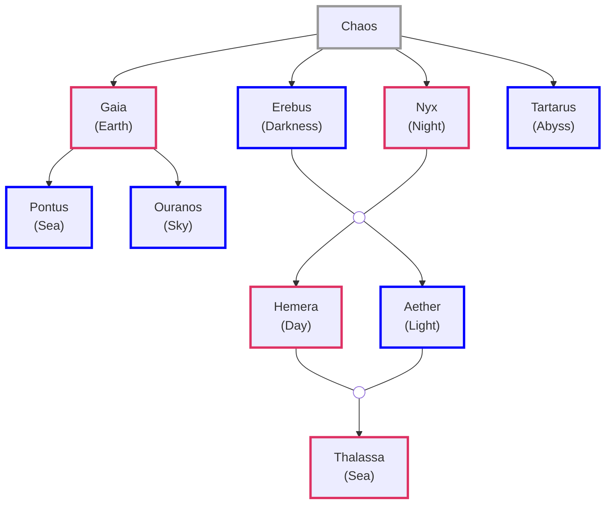

**Ouranos** (**Uranus**): Sky, Heavens  
**Thalassa** female counterpart of **Pontus**  
**Tartarus**: Greatest depths of earth

### The Second Order

Gaia loved the Cyclopes & Hecatonchires  
Ouranos was revolted by them and cursed them to never see the light  
They where pushed back into Gaia's womb

Gaia went to Mount Othyrs and from its rocks she crafted a weapon (Sickle)

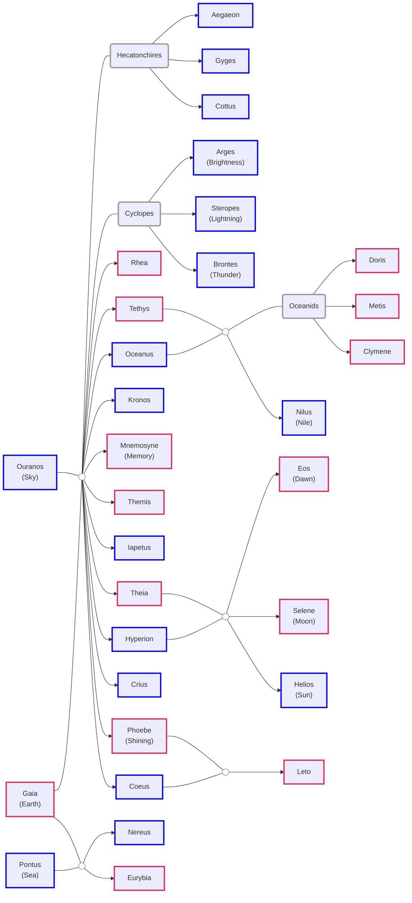

**Cyclopes**: One-eyed Giants  
**Hecatonchires**: Fifty Heads and Hundred Hands  
**Oceanids**: Sea Nymphs

**Cottus**: The Furious  
**Gyges**: The Long-Limbed  
**Aegaeon**: The Sea-goat (**Briareos**: The Vigorous One)

**Metis**: Clever and Wise  
**Themis**: Law, Justice & Custom
**Leto** (**Latona**): Demure

| Father   | Mother  | Children                                                   |
| :------- | :------ | :--------------------------------------------------------- |
| Oceanus  | Tethys  | Nile, other rivers & 3000 Oceanids - Clymene, Metis, Doris |
| Coeus    | Phoebe  | Leto                                                       |
| Crius    | Eurybia |                                                            |
| Hyperion | Theia   | Helios, Selene, Eos                                        |
| Iapetus  | Cylmene | Atlas, Epimetheus, Prometheus                              |

#### Nyx Decendents

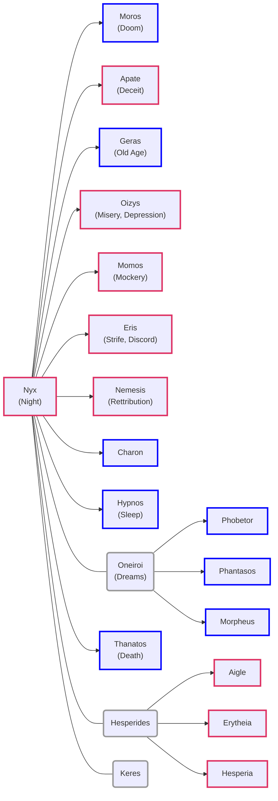

**Apate** (**Farus**): Fraud, Fraudulent, Fraudster  
**Geras** (**Senectus**): Senior, Senate, Senile  

**Oizys** (**Miseria** in Latin): Misery, Depression  
**Thanatos** (**Mors**): Death  

**Phobetor**: God of Nigtmares  
**Phantasos**: Things changing shapes in dream  
**Morpheus**: Shapeshifter  

**Hesperia**: Nymphs of the west and daughters of the evening (Magic Hour)

**Keres**: Death Goddess. Drawn to violet deaths on battlefield. Feasted on bodies

[Nyx - Wikipedia](https://en.wikipedia.org/wiki/Nyx)  
[What gods are considered to be kids of Nyx? - Quora](https://www.quora.com/What-gods-are-considered-to-be-kids-of-Nyx-Or-were-any-creatures-created-by-her-or-associated-with-her)

Kronos cuts his Fathers genitals and throws it over the mountain  
His Father curses him saying that his children would destroy him  
Ourano's blood fell on the ground and give rise to Eriynes, Gigantes and Meliae  
His genitals landed in the sea near the Ionian island which becomes Aphrodite

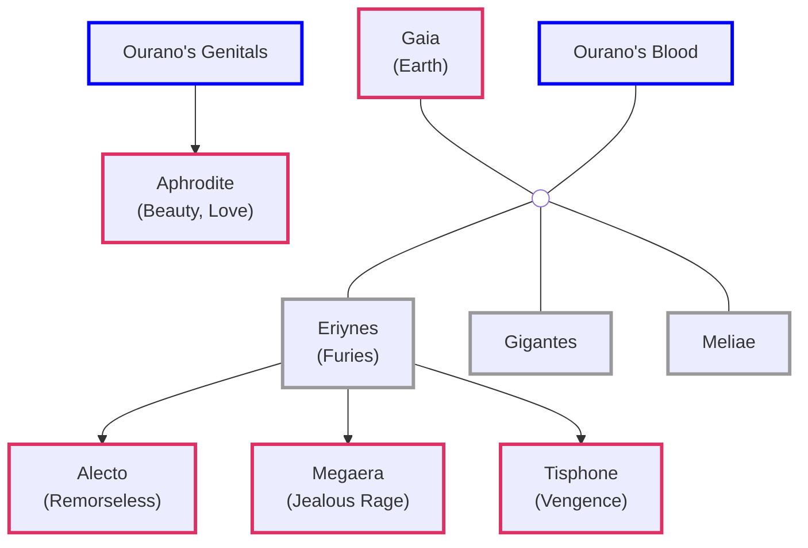

**Eriynes**: Eumenides (Kindly Ones)  
**Meliae**: Nymphs of the Ash Tree  
**Aphrodite** (**Venus**): Beauty, Love

#### Other Decedents

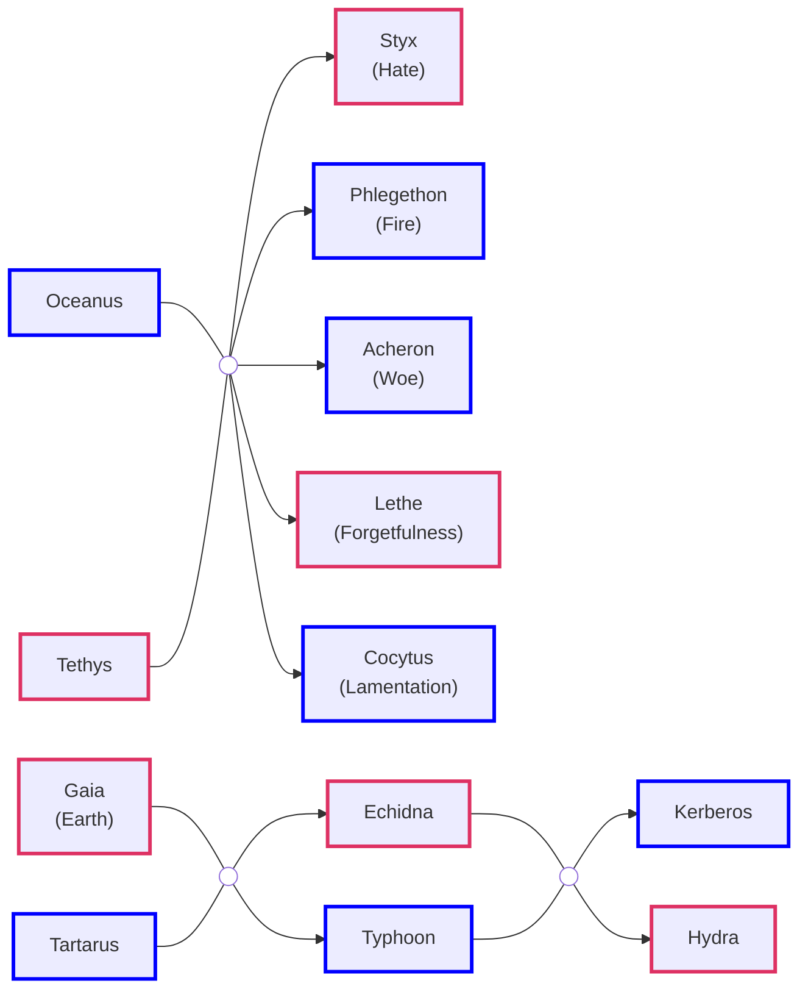

**Kerberos** (**Cerberus**): Three-headed dog with snake tail  

#### The Horai (Hours)

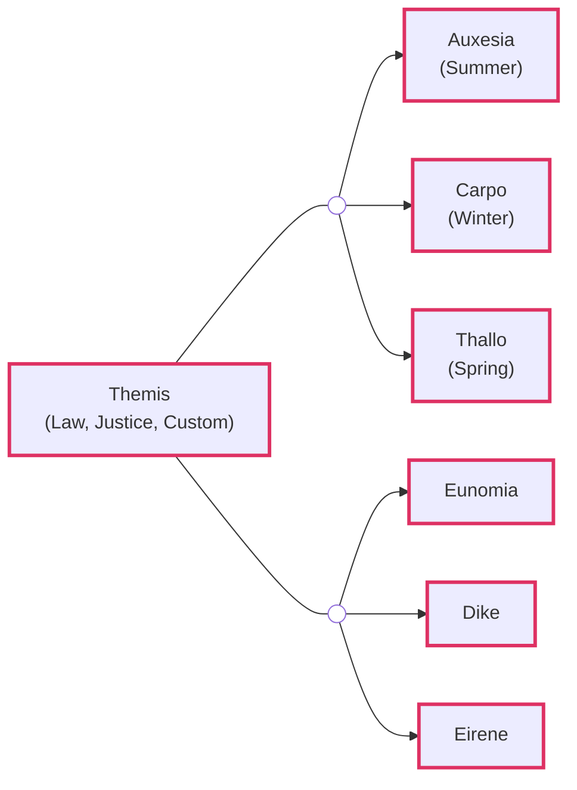

**Thallo**: Spring (Roman: **Flora**)

**Eunomia**: Law and Legislation  
**Dike**: Justice and Moral Order (Roman: **Justitia**)  
**Eirene**: Peace (Roman: **Pax**)

#### The Moirai (Fates)

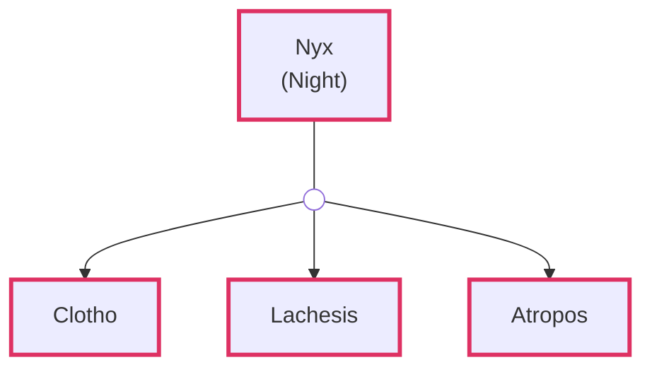

**Clotho**: Spins Thread of Life  
**Lachesis**: Measures Thread of Life  
**Atropos**: Cuts Thread of Life

#### The Gorgons

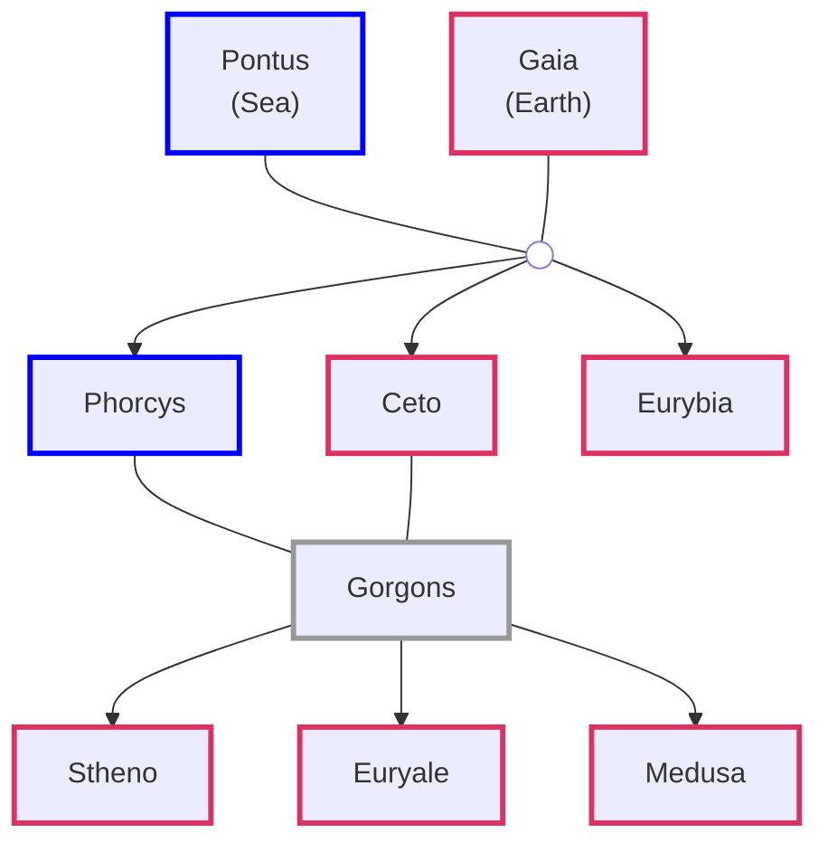

### The Third Order

Kronos became the Lord of the Earth, Sea and Sky  
He freed the Cyclopes & Hecatonchires from Gaia's womb  
He locked them up in Tartarus  

He swallowed the 1st five children that where born to him by Rhea  
Zeus was saved as Rhea tricked Kronos into eating a large stone  
Rhea went to Crete where Zeus was born and was taken care of by Meliae  
Rhea put Metis in charge of teaching Zeus guile, craft and patience  

Metis created a tonic which Zeus gives to Koros  
This causes Kronos to vomit out the children and stone he had eaten  

Zeus threw the stone far away. It lands in Pytho  
Zeus tried to kill Kronos but could not use the Sickle as Gaia was protecting her son  

The fierce war between the Olympians the Titans - **Titanomachy**  
Zeus releases the Cyclopes & Hecatonchires from Tarturas and promised them freedom if they helped him  

Zeus wins the war over the Titans and becomes God of the Heavens  
Exiles his father to travel the world, measuring out eternity in lonely exile  
Atlas (Zeus strongest enemy) is punished to hold the sky in place for eternity  
Hecatonchires are made guards of the roads that lead to the entrance to Tartarus  
Zeus assigns different domains to this siblings

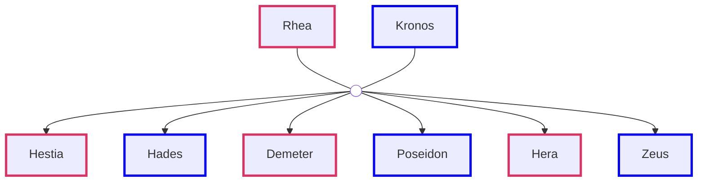

**Hestia** (**Vesta**): Hearth  
**Hades** (**Pluto**): Underworld  
**Poseidon** (**Neptune**): Ocean & Seas  
**Demeter** (**Ceres**): Harvest, Fertility and Seasons  
**Hera** (**Juno**): Marriage & Childbirth  
**Zeus** (**Jupiter**): Sky & Thunder

#### Poseidon Lineage

**Nereus** son of **Gaia** & **Pontus**
**Doris** daughter of **Oceanus** & **Tethys** 

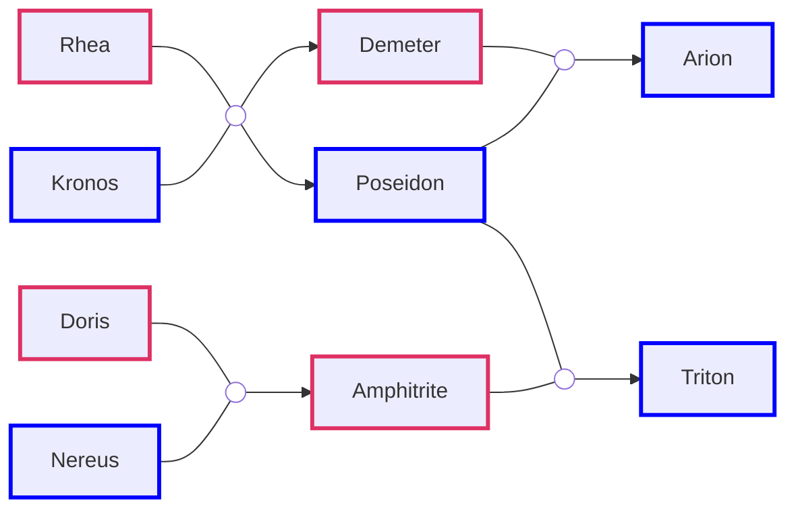

**Arion**: Horse with the power of speech  

#### The Nine Muses

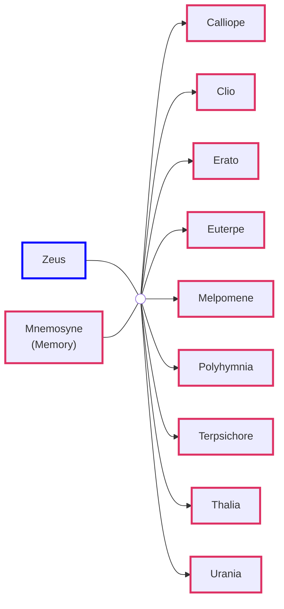

| Name                       | Position                    |
| :------------------------- | :-------------------------- |
| Calliope (Beautiful Voice) | Muse of Epic Poetry         |
| Clio                       | Muse of History             |
| Erato                      | Muse of Lyric & Love Poetry |
| Euterpe (Delight, Joyous)  | Muse of Music               |
| Melpomene                  | Muse of Tragedy             |
| Polyhymnia                 | Muse of Hymns               |
| Terpsichore                | Muse of Dance               |
| Thalia                     | Muse of Idyllic Poetry      |
| Urania                     | Muse of Astronomy           |

#### The Charities (Three Graces)

**Eurynome** (Oceanid) daughter of **Oceanus** & **Tethys**

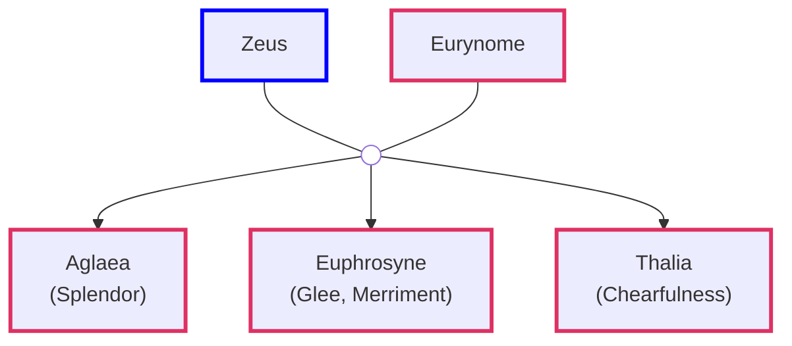

#### Olympian Children

Zeus had an affair with his sister Demeter and has a daughter Persephone  
Hera wants Zeus to be loyal to only her so she proposed the idea of public marriage  
When Hephaestus was born Hera throws him from Heaven  
On his parents wedding he traps her in a chair which no one can open  
Hephaestus is able to free her from the chair and is given Aphrodite as wife  

Zeus has an affair with Metis in which he ends up swallowing her  
Zeus later has a unbearable headache which no one could find a cure  
Hephaestus makes an axe and cuts Zeus head from which Athena is born  
Metis remained trapped in Zeus and acts like a consigliere to guide him

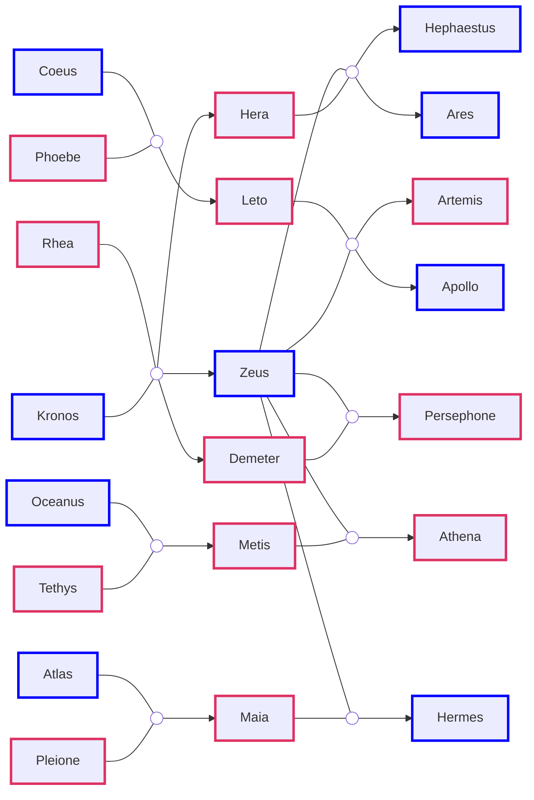

**Ares** (**Mars**): God of War  
**Hephaestus** (**Vulcan**): God of Fire & of Blacksmiths

**Athena** (**Minerva**): Wisdom, Warfare and Handicrafts  
**Artemis** (**Diana**): Wild animals, Hunt, Chastity and Childbirth  
**Apollo**: Sun, Archery, Healing, Prophecy, Knowledge and Music

Zeus has an affair with Leto. Hera hears about it and gets angry  
She asks Gaia to to put a curse on Leto and not provide her any place to give birth  
Leto eventually makes it to Delos a small island which is not bound to the Earth  

**Omphalos** stone that Rhea used to prevent Kronos from eating Zeus  
It landed on **Mount Parnassus** at a place called **Pytho**  
Considered the center of the world by the Greeks  
On command of Gaia a guardian of the stone emerged - Python  

Leto gives birth to Artemis and Apollo. Hera tries to kill them using Python  
Apollo asks Hephaestus to make bow and arrow for him using which he kills Python  
Python comes back to life as its protected by Gaia    
Apollo is exiled and replaces Python as the guardian of **Omphalos**  

Pytho was later named to Delphi by Apollo  
Apollo was tasked by conducting athletic tournaments - Pythian Games  
Apollo also established an Oracle who anyone could ask about the future  

**11 Olympians**  
Zeus, Hera, Hestia, Poseidon, Demeter, Aphrodite  
Hephaestus, Ares, Athena, Artemis, Apollo

Zeus has a secret affair with Maia and has Hermes who becomes the 12 Olympian  

**Hermes** (**Mercury**): Messenger of Gods, God of the Travelers, Thieves, Merchants  

### The Toys of Zeus: Part 1

Zeus comes up with the idea of creating mortals    
**Prometheus** sculpts the beings, **Gaia**'s clay creates them, **Zeus**'s spit holds them together, **Apollo**'s fire (Sun) was bakes them and **Athena**'s breath gave them life  
The mortal beings where called **Anthropos**  

#### The Golden Age

The beings were free to do whatever and go wherever they liked 
But they where forbidden from learning to create **fire**  

Life was simple at this time, there was so famine, poverty or diseases  
Prometheus liked the humans the most and spend a lot of time with them  
He was saddened that the lack of fire would not allow them to progress and evolve  

Prometheus scaled Mount Skolio and from Hephaestus forge stole fire by concealing it in a giant fennel stalk  
Zeus was angry with Prometheus and the humans and punished them  

#### The Punishments

Zeus had Hephaestus create a female into whom life was breath by **Aphrodite**  
Some of the Gods joined in to confer upon the female notable talents  
The female was named All-Gifted (**Pandora**)  
Pandora was given a container (jar) which Zeus told should never be opened 

Pandora was married to **Epimetheus** (Prometheus's brother)  
One day Pandora could not resist her urge so she opened the jar  
She unleashed on the world Illness, Violence, Deiced, Misery and Want  

The creatures that where freed from the jar where - Ponos (Hardship), Limos (Starvation), Algos (Pain), Dysnomia (Anarchy), Pseudea (Lies), Neikea (Quarrels), Amphelogiai (Disputes), Makhai (Wars), Hysminai (Battles), Androktasiai (Manslaughter) and Phonoi (Murder)  
There where the descendants of the dark and evil children of Nyx and Erebus  
When Pandora closed the jar hastily she imprisoned forever Elpis (Hope)  

| Parent     | Mother          | Children      |
| :--------- | :-------------- | :------------ |
| Epimetheus | Pandora         | Pyrrha        |
| Prometheus | Clymeme/Hesione | Deucalion  |

Lycaon was one of the original clay humans created by Prometheus  
**Lycaon** killed his own son **Nyctimus** and offered it as a sacrifice to the Gods  
Zeus revoted by this brought the boy back to life and turned Lycaon into a wolf  
Lycaons sons rules with extreme violence and behaved in a very disgusting manner  
Zeus causes a flood which killed everyone in Greece and the Mediterranean region  

**Pyrrha** & **Deculian** survived the flood went to Delphi to consult the oracle **Themis**  
Themis instructed them to throw the bones of their Mother over their shoulder if they wanted to have decedents  
They throw stones and the place where the stones feel gave rise to a new generation of men and women  

The new generation because of the plague unleashed by Pandora were not immortal and had to deal with the inevitability of death  

Hermes was given the task of escorting the souls of important death people to hades the rest was taken by **Thanatos** (Death)  
They would bring the souls of the people to the cavern where the River Styx and River Acheron meet were Charon would ferry them to Hades  
If the dead could not have payment, Charon make they souls wait for 1000 years before they were offered safe passage  

The task of weighing the souls of the death (Judge of the Underworld) was assigned to **Minos** and **Rhadamanthus** along with their half brother **Aeacus**

Hero's, Righteous and ones with divine blood were transferred to Elysian Fields  
The souls of the ones who were reincarnated three times and still lived a virtues life was transferred to the Isles of Blessed  
The Blameless and ordinary where transferred to the Meadows of Asphodel were they would send their eternity. These souls were granted a pleasant enough afterlife. They drank from River Lethe (forgetfulness) so they could spend their eternity without remembering their life on earth  
The least of the sinners were forced to spend their eternity in the halls of Hades without any feeling, strength or consciousness  
The worst of the sinners where sent to the Field of Punishment were they are forced to bear punishment for their crimes for eternity  

The Silver age still had gods, demigods and all other kinds of immortals

Zeus was furious to see that some of the humans had survived and had started a new civilization. He finally decided to punish Prometheus. To was taken to Caucasus Mountains were the Cyclopes were present he was chained to the mountain with unbreakable iron. Every day vultures would come and eat his liver this was his punishment for eternity  

#### Persephone and the Chariot

**Persephone** (Proserpina). Also called Kore, Cora which means maiden  
One day the ground opened up a chariot swooped her up and vanished  
With the help from **Hecate** (Goddess of witchcraft and enchantments) **Demeter** search the corners of the world for her daughter  
Demeter neglected her responsibilities and crops stopped growing  

Helios tells the Olympians that Persephone was taken by Hades  
Zeus tells Hades to return her but he refuses  
In the end Hades tells Zeus to give him one more day with Persephone  
Hades tells Persephone that she will be returning to the overworld but to show that she has no ill feelings to share some pomegranate seeds with him  
Persephone ate six pomegranate seeds  
When Hermes came to fetch Persephone Hades informs him that she has eaten food from the underworld because she is bound to it. Every six months she has to return to the underworld  
This gave rise to seasons, Autumn and Winter signal Demeter morning Persephone's return to the underworld    

| Father | Mother        | Children       |
| :----- | :------------ | :------------- |
| Hermes | Dryope        | Pan (Faunus)   |
| Hermes | Aphrodite     | Hermaphroditus |
| Hermes | Unknown Nymph | Silenus        |

**Hermaphroditus** travelled to Asia Minor were he met a naiad called **Salmacis**  
Salmacis tried to flirt with Hermaphroditus but he was not having any of it  
When Hermaphroditus was having a bath Salmacis leaped on him and prayed to the Gods that they never be separated  
The Gods combined to create a new being that had two sex  
In this form Hermaphroditus become part of the Erotes

#### Cupid and Psyche

**Aphrodite**: Goddess of Love and Beauty  
Assisted by the naked godlings called **Erotes**  

| Erotes         | Responsibility                                                     |
| :------------- | :----------------------------------------------------------------- |
| Anteros        | Patron of selfless and unconditional love                          |
| Eros           | God of physical love and sexual desire                             |
| Hedylogos      | Spirit of the language of love and terms on endearment             |
| Hermaphroditus | Protector of mannish females and gender fluid people               |
| Himeros        | The embodiment of desperate, impetuous love                        |
| Hymenaios      | Guardian of the bridal chamber and wedding music                   |
| Pothos         | The personification of longing of love for the absent and departed |

Ares and Aphrodite: Eros (Cupid)

| Love   | Explanation                                                               |
| :----- | :------------------------------------------------------------------------ |
| Agape  | Holy love (Charity) - Parents and children, worshippers and their Gods    |
| Eros   | Sexual Romantic Love                                                      |
| Philia | Friendship, Partiality and Fondness                                       |
| Storge | The type of love one might have for their country or favorite sports team |

In a land far away lived king Aristides and queen Damaris  
They had three daughters Calanthe, Zona and Psyche  
Psyche was so beautiful that people  worshipped her in place of Aphrodite  
Aphrodite was jealous of Pysche and wanted to humiliate her  
She asked Eros to find the ugliest pig and place it in Psyche's chambers      
When Eros saw Psyche he fell in love with her  

Aristides worried about his daughter went to the oracle of Apollo  
Oracle told him to place his daughter with garlands on a rock on a high place as a sacrifice to the gods    
Psyche was lifted by the gentle arms of **Zephyrus** (The West Wind) and was taken to a far away land  
In the land she entered a castle were she was told that the castle and all the land around it belonged to her  
This was Eros's castle he made love to Psyche every night and soon she started liking him  
Some a year passed and Psyche wanted to met her sisters, Eros granted the wish  
The sisters can to the palace and they were jealous of their sisters fortune  
They did not say anything, Psyche became pregnant and wanted to see her sisters one last time  
The sisters talked Psyche into believing that the person with whom she was sleeping was a monster and convinced her to kill him  

When Psyche say the face of the person she immediately understood it was Eros  
Eros woke up and saw that Psyche had seen his face so he left and with it disappeared the castle.
Psyche was now in the middle of a forest and was planning to take her life but was stopped by Pan.
Psyche decided to get revenge of her sisters  
She tells them that her husband was Eros and he wanted to be with them and the wind would come to collect them from the high on the mountain  
When they jumped they were not caught by Zephyrus and they feel to their deaths

Eros was wounded by the lamp oil and neglected his duties  
The people started praying angrily to Aphrodite who was angry to know that Eros was not doing his job  
She become vexed when she came to know Eros's heart was broken by the same girl was she had commanded Eros to humiliate  

Aphrodite locked Psyche in a room and spilled different types of grains on the floor and told her to get her freedom she had to separate the grains before next week  
Psyche was helped by the ants in the room and completed the task in time  
Next, Aphrodite told her to collect the golden wool from the sheep's that were grazing in the pastures which Psyche was also able to complete  
Finally, Aphrodite asked Psyche to go to the underworld and get a beauty cream from Persephone  
A swallow told Eros of all the trials that Aphrodite was making Psyche perform he got up and demanded an audience with Zeus  
Zeus called all of them to Olympus and made Psyche immortal and she was wed to Eros  

Eros and Psyche had a daughter **Hedone** (**Voluptas**). She was the spirit of pleasure and sensual delight

### The Toys of Zeus: Part 2

#### Mortals

Inachus was one of the earliest rules or Greece  
Inachus by his consort had two children Io and Mycene  
Mycene was married to a the nobleman Arestor  
Io was raised as a priestess in the shrine of Hera  
Io attracted the lustful eyes of Zeus  

Zeus taught of turning Io into a cow to hide her away from his wife  
Hera immediately identified the true nature of the cow  
Hera demanded Zeus to give her the cow as a gift on her birthday  
Hera assigned Argus son of Mycene and Arestor to watch over Io  
Argus has a hundred eyes. He was called Panoptes (all-seeing)  

Zeus enrolled the help of Hermes  
Hermes went to the paddock were Io was held and started playing his flute  
Once Argus feel asleep Hermes stabbed him in the heart  
When Zeus came to free Io, Hera sent a gadfly that prick Io causing she ran away  
Hera took Argus's eyes and fixed then on a dull which became the peacock  
Io reached Caucasus the place were Prometheus was chained  

Io meet up Zeus in Egypt and bore him a son Epaphus (Touch)  
They also had a daughter called Keroessa  
Byzas (Kerossa's son) founded the city of Byzantium  

#### The Semen-Soaked Scarf

Hephaestus had developed a strong passion for the goddess Athena  
He tracked her down to a high corner in Olympus and forced himself on her  
He spilling his seeds only on her thigh. Athena wiped it and throw it down  
The semen soaked cloth feel on Gaia and gave birth to a boy - Erechtheus  
Athena put the boy in a basket and took him to Herse, Aglauros and Pandrosos (mortal sisters)  
Herse and Aglauros opened the basket and found a boy bound by a writhing snake  
Snakes are sacred to Athena and this one was enbowing the infant with immortality  
The sight caused them and they jumped off the mountain Acropolis (high citadel)  
Erechtheus fathered Erechthonius the founder of Athens  

#### The Son of the Sun

Phaeton son of Apollo and Clymeme was raised by his stepfather Merops (mortal)  
Epaphus and Phaeton went to school together  
Epaphus liked to boss over his classmates. Phaeton did not like this  
Phaeton was sad that he had never meet his father  

Clymeme explains that Apollo is busy riding the sun chariot everyday  
Clymeme hands Phaeton a flute that was made by Apollo  
Phaeton does not like it since it does not do anything special and throws it away  

Epaphus invites Phaeton to a family trip  
Phaeton tells Epaphus that he is going to ride the sun chariot soon so cannot come  
Phaeton goes to the template of the Sun to meet his father  
Apollo promises to grant Phaeton one wish  
Phaeton says he wants to ride the sun chariot  
The stallions were called - Pyrois, Phlegon, Aeos, Aethon  

Eos (Rhododaktylos) the rosy-fingered opens the gates to let the stallions out  
Helios comes up and is surprised to see a mortal handle the horses  
Phaeton is placed in the chariot and is told to fly to the Garden of Hesperides 
The journey is 12 hours long and he should use a middle height path over the earth  

When they reached the region close to Nilus, Phaeton pulls on Aeos  
This cause all the horses to go off course and crash towards the earth  
And the last minute the horses corrected their course and headed upward  
This cause the region north of Africa to be burnt to a crisp we call it Sahara  
Scared or confused by the lack of Apollos hands the horses headed up high  
This caused the seas and freeze and the land to turn into ice  

The news of the chaos reached Zeus  
He used his lightening bolt and struck Phaeton who feel into a sea and died  
The lack of the boy pacified the horses and they started going in the right direction  
Apollo was saddened by the death of his son and never wrote the sun chariot again  
That duty was given to Helios  

Phaeton's friend Cygnus went to the river and crying loudly  
Apollo struck him dumb and eventually out of pity turned him in a swan  
The bird is quite all is life until when its going to die it sings its swan song  

Epaphus married Nilus's daughter Memphis  
They had a daughter Libya. This grand-son Aegyptus went on to rule Egypt  
Phaeton was placed amongst the stars in the consolation Auriga, the Charioteer  

#### Cadmus

Due to Phaeton deserts and polar regions were now present  
King of Levantine city of Tyre, Agenor (Poseidon & Libya) and his Queen Telephassa (Nilus & Nephele) had five children: Europa, Cadmus (Kadmos), Cilix, Phoenix and Thasos  
Cadmus was epically gifted in throwing stones, discusses and javelins  

Europa was playing in a meadow when her attention her gaze wandered onto a bull  
The bull was Zeus in disguise. The bull with Europa flew all the way to a Crete  
Europa bore Zeus three sons: Minos, Rhadamanthus and Sarpedon  

The king and queen instructed their sons to look for their sister  
Phoenix succeeded Agenor to become the ruler and named this capital Phoenicia  
He created and propagated the used of alphabets  

On Samothrace lived a Pleiad called Electra (Atlas and Oceanid Pleione)  
By Zeus Electra had sons Daranus, Iasion and a daughter Harmonia  
Cadmus feel in love with Harmonia  

Cadmus and Harmonia visited the Oracle to find their goal in life  
He was told to chase after a heifer marked with a half moon and were it falls exhausted, he has to build  

The King of Phocis, Pelagon heard about their arrival and invited them to stay  
Cadmus took part in the Phocian games that were held and won  
As a reward the king gave him a cow which had a crescent moon on its back  

Happy Cadmus and Harmonia left the city and followed the cow till it fell down  
Once the cow was dead they decided to offer it to Athena so that they could receive guidance on what needs to be built  
To purify the cow Cadmus asked his soldiers to get some water but they could not as they were attacked by a Water Dragon  
Cadmus at once slayed the dragon. The dragon was supposed to be sacred to Ares  
Athena blessed their offering and instructed them to plant the teeth of the dragon

The teeth’s gave rise to Spartoi (sown men)
The Spartoi started fighting with each other. Cadmus threw a rock at them and because of it they started fighting each other    
There were 5 Spartoi warriors who formed a circle in the center of the battlefield (the sole survivors)  
They became the founding lords of Thebans  

Aphrodite lent Harmonia her girdle (a magical item of lingerie)  
Cadmus gifted his bride a neckless which consisted of expensive jewels  
The neckless was created by Hephaestus on order by his wife Aphrodite who was ordered her lover Ares  

After many years Cadmus and Harmonia decided to visit the world and one day he grew restless and called up to the skies saying that for 30 years he has known that Ares is not going to rest until he is punished. If Ares is not happy until he is flat on the earth may it be so  
So sooner had these words been spoken Cadmus was turned into a snake  
Harmonia cried out in pity to show mercy. Artemis in the end turned Harmonia into a snake just like her husband  
The pair lived in the shadows of a temple sacred to Athena  

#### Twice Born

Semele had scarified to Zeus a bull of especially impressive size  
She was washing the blood from her body in the river Asopos  
Zeus fell in love with Semele and made love to her  

Word of this reached Hera. Hera disguised as an old women visited Semele  
Hera tricked Semele into believing the man she made love with was not Zeus  
She told Semele to ask the man to show his true form if he really was Zeus  
Her own sisters did not believe that she was in love with Zeus  
When Zeus came to visit Semele, she asked him to grant her a wish  
Zeus agreed. Semele asked Zeus to show his really form. He was frightened and insisted Semele to ask for a different wish but she was insistent  
Zeus transformation to his true form was so bright and powerful that it instantly killed her. Zeus fetched the fetus from Semele’s belly and tucked it inside his thighs  

The fetus grew to become Dionysus. He found how to make wine from grapes  
Dionysus is followed everywhere by Silenus, his retinue of satyrs and women followers called Maenads  
Dionysus was established as the god of wine, revelry, delirious intoxication  

The gods liked him and wanted to add him as an Olympian but thirteen was considered as an unlucky number  
Hestia decided to step down as an Olympian as she felt she was need more in the world to help with their families  

