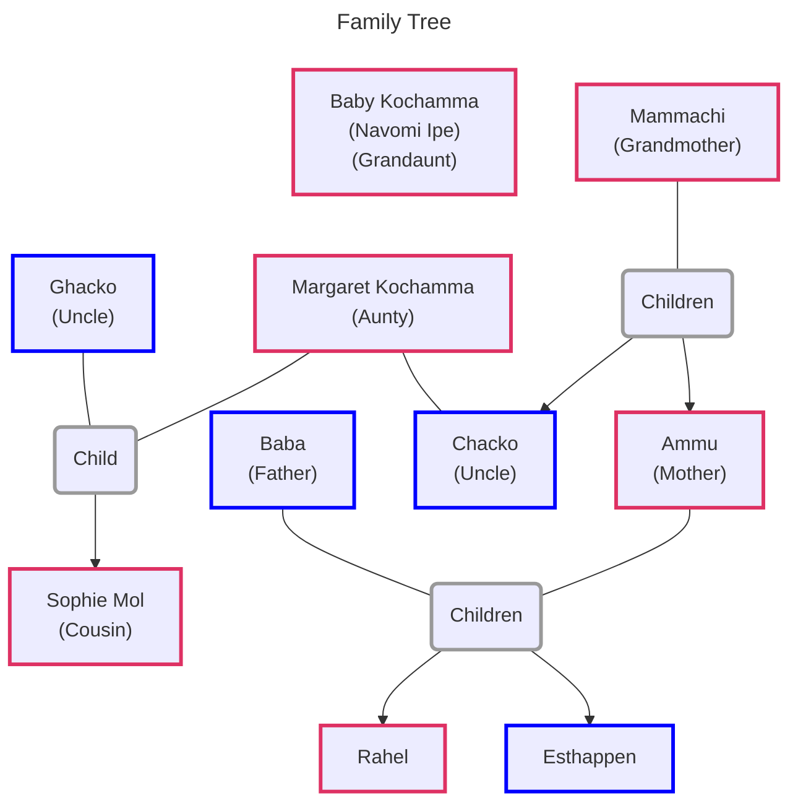

![[the-god-of-small-things.jpg|300]]

Book Link: [The God of Small Things](https://www.goodreads.com/book/show/9777.The_God_of_Small_Things)

[Plot Summary & Analysis - LitCharts](https://www.litcharts.com/lit/the-god-of-small-things/summary)

