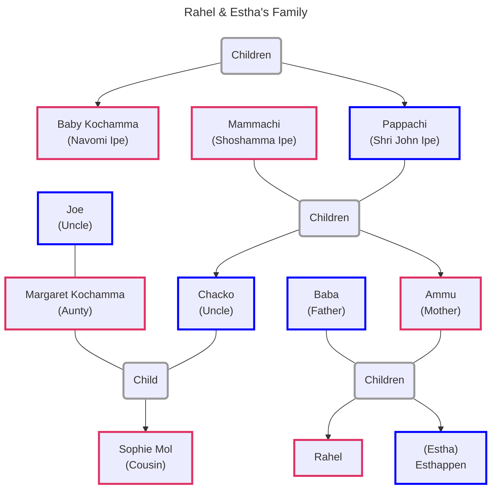
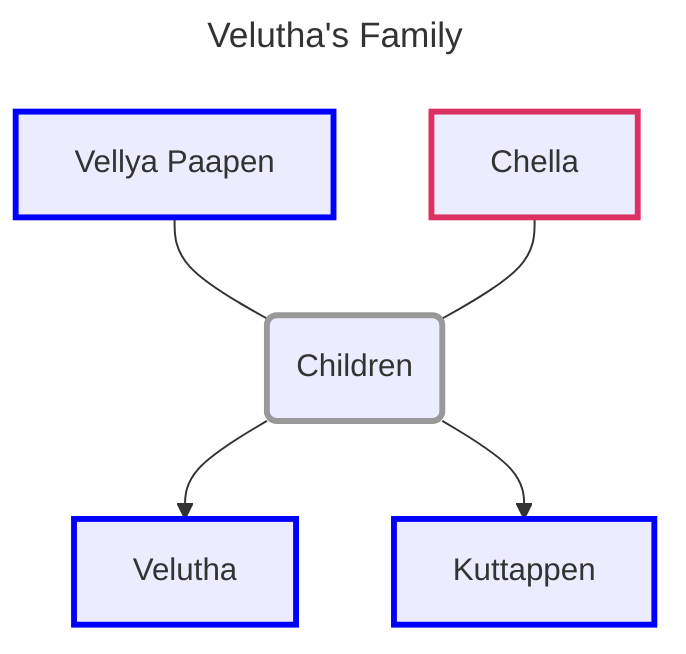

![[the-god-of-small-things.jpg|300]]

Book Link: [The God of Small Things](https://www.goodreads.com/book/show/9777.The_God_of_Small_Things)

[Plot Summary & Analysis - LitCharts](https://www.litcharts.com/lit/the-god-of-small-things/summary)

#### Chapter 1: Paradise Pickles Preserves

- We are introduced to the town of Ayemenem (Kerala, India)
- 1993 Rahel (age 31) returns to her family home were her grant aunt lives
- Rahel had come to meet her twin brother. Not seen each other in 23 years
- As children they taught of themselves as same person in different bodies
- We are told about the twins birth which almost occurred on a bus
- 1969 (twins were 7 years old) they are at Sophie Mol’s (cousin) funeral
- Ammu, Estha and Rahel are made to stand separate from the family at funeral
- Rahel imagines Sophie is still alive and she shows Rahel things in the church
- Rahel things of a man falling from a high ledge in the church and dying
- After church Ammu and twins go to police station to meet Velutha
- The police calls Ammu a prostitute and tells her to go home quietly
- After 2 weeks Estha is sent to Calcutta. Estha become quieter and quieter
- The quietness helps him erase the words describing his painful memories
- 23 years later Estha was re-returned to Ayemenem
- The story follows Rahel’s life. Lived with Chacko and Mammachi
- Rahel drifts from school to school getting expelled for different reasons
- Rahel goes to a architecture school in Delhi, stays 8 years without graduating
- Meets Larry marries and moves to Boston. Larry eventually grows tired of Rahel
- They divorce. Rahel comes back to Kerala hearing about Estha’s return
- Grandaunt does not like the twins and wishes that they would leave soon
- She is 83 and wears Mammachi’s jewelry and uses lot of makeup
- She fell in love with a Irish monk at the age of 18
- She performs charitable actions to impress the monk. Nothing comes of it
- Monk leaves Kerala, Baby follows him to Madras. She becomes Roman Catholic
- She joins convent but soon realizes cannot meet the monk
- Baby’s father knows she will not get a husband anymore and sends her to study
- 50 years later Baby discovers TV and spends all her time watching TV with maid
- She had now become paranoid of everything and does not own windows, doors
- We are told of the pickle factory that is across the river from their house
- 1969 after Sophie’s death Ammu consults twin expert to separate her children
- Sends Estha to Calcutta. Estha still haunted with painful memories from past

#### Chapter 2: Pappachi’s Moth

- In 1969, the twins, mother, uncle and grant aunt are going to watch a movie
- Sophie and Margaret (Englishwomen) come to visit their family in Kerala
- Ammu does not have a surname (husband less)
- Ammu is 27, remembers her past. Lived with her father
- With to Calcutta for a wedding meets a man gets married and moved to Assam
- Realizes that the man is an alcoholic and a compulsive liar
- Ammu’s husband tries to prostitute her to his boss to keep his job
- Ammu refuses starts beating her. Violence eventually spreads to the twins
- Ammu takes the twins and returns back to fathers house
- Describes Ammu’s behavior (wild & unsafe sometimes, caring & kind the others)
- Back in the car we understand that grandaunt does not like the twins
- They are half-Hindu and the children of an divorce
- Rahel thinks about the ad for their pickle business on the cars roof
- The business is run by their grandmother
- Starting becoming popular when grandfather was about to retire
- Pappachi beats Mammachi as he is bitter and jealous
- One day adult Chacko notices this and scolds Pappachi
- Pappachi does not speak with Mammachi again. Destroys a chair out of anger
- Pappachi worked as a Entomologist. He discovers a new species of month
- At the time no one considered it a new species
- Only classified as new after him retiring so was not named after him
- Pappachi considered this the greatest failure in his life
- Chacko tells them that they are all anglophile’s
- Chacko laminates over the state of the Indian people
- Cacho moved to Ayemenem after dead of Pappachi to become pickle baron
- Takes over the business for Mammachi, hires new workers and equipment
- Even with the influx of cash the business slowly starts to decline
- Back in car the twins are worried they will miss the start of their movie
- They stop at a train crossing. Twins read the signs and warning backwards
- A friend of grant aunt got them a kids book which felt was too childish
- They read the book backwards. Friend says she sees Satan in their eyes
- All the cards turn off their engine. Beggars and vendors appear
- They disappear when a huge march of Marxist sweep through carrying flags
- Chacko is an Marxist but is rich landlord so is quite and scared
- Grant aunt is scared of them and tries to avoid eye contact
- We are told about the rise of the Communist movement in Kerala
- Cacho became a beleiever in Marxist in college had fights with Pappachi
- Communist party elected in Kerala. Government grew more and more violent
- Eventually power was returned to Congress. Political turmoil for 10 years
- Communist party reelected. Famine starts in India. Party puts revolution on hold
- CCP not happy with this. They fund a offshoots of the party called Naxalites
- Naxalites starts arming villages and kill people in the name of revolution
- Marches are protesting for a pay increase and abolishment of the caste system
- Rachel sees Velutha open windows to call him. He vanishes into the crowd
- Velutha is an untouchable that works at the pickle factory
- Velutha was very skilled with his hand and learnt carpentry from a German
- He build furniture of the Ipe’s and even assembled machines in the factory
- His father was worried as Velutha did not show shame of an untouchable
- Velutha disappears for 4 years. On return is rehired at the pickle factory
- We are informed of some incident that occurs. Veutha’s father offers to kill him
- At the same time Velutha and the twins have come close
- Back in the car one of the marchers open the door and mocks Baby
- They make her wave their flag. The marchers clear out. Baby is humilated
- Chacko asks Rahel if she really saw Velutha as it would cause trouble at factory
- Baby treats Velutha with anger in the following days
- Sees him as the marcher that humilated her
- Twins think about the story of Julius Caesar and of how he was backstabbed
- Ammu tells this to tell them how no one could be trusted
- The twins blow bubbles with spit which makes Ammu angry. 
- Remids her of Baba. Chacko defends them. 
- Ammu tells him to stop acting as he does not really care about them
- Chacko agrees and says they are milestones around his neck
- The train passes and they drive away

#### Chapter 3: Big Man the Laltain, Small Man the Mombatti

- 1993 the Ayemenem house has become decrepit and filthy
- Baby always watches TV
- Estha comes home quitely and Baby predicts what he is going to do
- Rahel follows him to his room (Ammu’s old room)
- Watches Estha undress. Rahel touches Esthas ear, he does not respond
- Processeds to washing his cloths

#### Chapter 4: Abhilash Talkies

- 1969 they reach the theater. They go to the men's and girls washrooms
- Chacko is at the hotel booking their rooms for the night
- They enter the theater. Move has already started. They find their seats
- A song starts playing Estha cannot control himself from singing
- Everyone in theater gets angry. Ammu sends Estha out to the lobby
- Estha sings in the lobby. Wakes up the Lemondrink Man
- Angry and first but convinces Estha to come behind the counter for drink
- Man makes Estha hold his penis while he drinks lemon juice
- Man asks Estha were he is from and about his family
- Man ejaculates into Estha’s hand, wipes it off and sends him off
- Estha is traumatized and compares the clean white children from the movie
- Feels they are deserving of more love than him as he is unclean
- Compares Sophie to white children. Estha feels nauseated
- Ammu takes him to the wash room. He cleans his face and hands continuously
- Lemondrink man is friendly to Ammu but also says he knows where they live
- Estha understands that this is a indirect threat and says nothing to Ammu
- Ammu makes everyone leave the theater. Worried Estha has caught cold
- The Lemondrink man offers Rahel candy but she is repulsed by his yellow teeth
- When they walk out Ammu compliments the mans politeness
- Rahel without tells Ammu to marry him in that case. Everyone freezes
- Ammu tells Rahel when you hurt someone they love you less
- Rahel feels a moth land on her heart and that she is less loved by Ammu
- When the reach the hotel they finds that Chacko is feasting
- Rahel asks Ammu to punish her as she does not want to be loved less
- Rahel sleeps in Chacko’s room. Estha with Ammu and Baby
- In the night Chacko thinks about Sophie who he has not seen in a long time
- Rahel asks if possible for parents to love children less. Says anything is possible
- Estha wakes up and vomits. He goes and stands outside Rahel’s room
- Rahel opens the door and lets Estha in. Chacko ignores them
- Thinks if Velutha was really present in the march
- Pillai has been trying to get the factory workers to rebel against Chacko
- Velutha is the only card carrying Communist but Pillai does not want him
- The factory workers ask for a raise but Mammachi denies them the raise
- Chacko thinks about starting a Union of his own
- The twins sleep while embracing each other

#### Chapter 5: God’s Own Country

- The story continues in 1993 were the river across the house had dried up
- The history house has been turned into a 5-star hotel
- Narrator mentions that small things still linger there (Rahels watch buried in dirt)
- Rahel walks around their house and runs into Comrade Pillai
- Rahel tells him she is divorced. Pillai shows her pictures of his son (Lenin)
- Rahel remembers Lenin from her childhood
- Both had object lodged up their nose and had to go to the doctor
- Pillai shows a Rahel a photo that has the twins, Lenin and Sophie
- It was taken few days before her death

#### Chapter 6: Cochin Kangaroos

- 1969 waiting at Airport for Margaret and Sophie
- Made to wear nice cloths and told to be at their best behavior
- Rahel digs threw trash. Estha lost in taughts about the Lemondrink man
- They guests arrive. Everyone greats each other and only says small things
- Estha is distracted by a famous comedian who drops his things
- Baby tries to impress Sophie by quoting Shakespeare
- Estha does not greet Margaret back and Ammu gets angry at him
- Rahel disappears into a curtain and refuses to come out
- Ammu scolds the twins for not listening to her in public
- Chacko goes with Sophie and Margaret to collect their luggage
- Ammu tells them to go and talk with Sophie properly
- Sophie says that she loves Joe the most and does not consider Chacko her dad
- They drive back him. They see a dead Elephant on the way back
- Baby makes them sing a song to showoff their English pronunciation

#### Chapter 7: Wisdom Exercise Notebooks

- In 1993 Rahel goes threw Pappachi’s study
- In her old hiding place she finds the rosary she stole from Baby
- Estha appears in the doorway but does not say anything
- Rahel finds that Ammu has hidden “Wisdom Exercise Books” in same place
- It was used by the twins to practice writing when they were 6
- Rahel reads threw the story laughts at them. Corrections by Ammu below them
- The story shifts to a earlier time when Ammu came to Ayemenem for last time
- She was kicked out by Chacko. Ammu was fired from a job for being too sick
- Rahel had just been expelled from school. Ammu bought her children’s gifts
- Ammu wants to freeze time to the period when the twins were kids
- At lunch Mammachi suggested to Ammu not to vist anymore
- Ammu leaves in silence and never returns
- Ammu died alone in a lodge at the age of 31
- She dreamed of police comming to cut her hair to mark her as a prostitute
- Chruch would not burry her. So the body was taken to crematorium

#### Chapter 8: Welcome Home, Our Sophie Mol

- Mammachi is waiting at home for Sophie Mol to return. She is almost blind  
- Thinks about her first batch of pickles and the leaking bottles
- Mammachi thinks about Margaret who she does not like
- Thinks about Chacho and his affairs with women from the factory (His Needs)
- She pays the women money so in her mind she can justify them as prostitutes
- In kitchen Kochu Maria is making a cake for Sophie Mol
- When the car arrived everyone stops there work and gathers around the car
- Rahel sees Velutha and goes to play with him as she is no longer required
- Rahels feels like everyone is in a play to impress Sophie Mol
- Rahel tells Velutha she saw him in the march he denies it
- Kochu Maria sniffs Sophie Mol’s hand and Margaret makes an insensitive joke
- Ammu gives a scarsactic reply. Chacko gets angry and asks for apology
- Ammu storm off. Everyone wonders where Ammu got her rebellious behavior
- She learnt it from her father who was nice to others but bad to his family
- Kochu Maria cuts the cake and Mammachi instructs to give everyone a piece
- Kochu Maria boosts to Rahel that Sophie will be the next Kochamma
- Rahel gets angry and storms away to kill some ants
- Sophie comes over and tells her to leave one ant lonely. She ignore her and kills it
- The entire crowd follows Sophie. Rahel runs away

#### Chapter 9: Mrs. Pillai, Mrs. Eapen, Mrs. Rajagopalan

- in 1993, Rahel explored the abondoned ornamental garden
- Remembers Sophie tells she likes Joe more than Chacko
- And she feels lonely when the twins leave her behind
- The twins take Sophie to meet Velutha. All dressed as ladies
- Rahel thinks of how sweet Velutha was playing along with their fantasies
- Rahel sees Estha in his room and things thinks of their troubled past
- She wishes Estha could think of them as victims not perpetrators
- She understands that the only true victim was Velutha
- She hears the kathakali from a History House and goes towards it
- Sees the remains of Paradise Pickles
