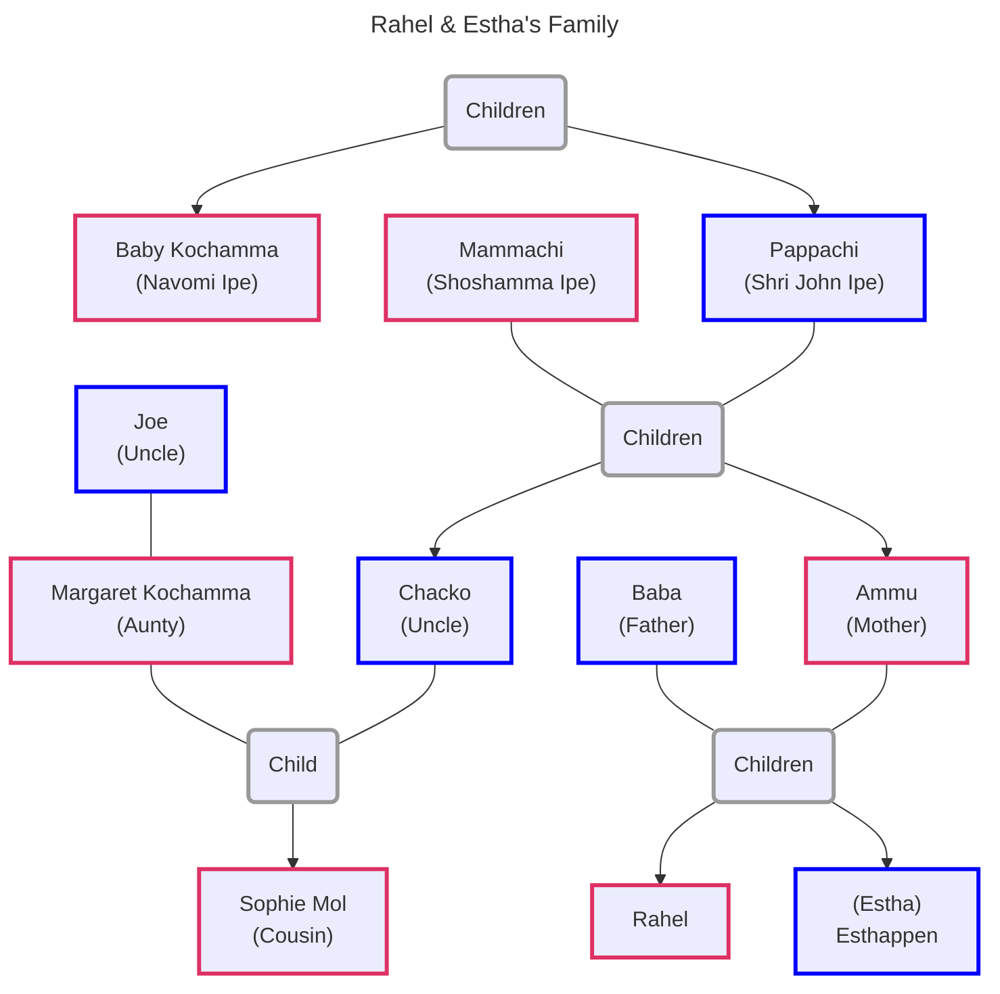
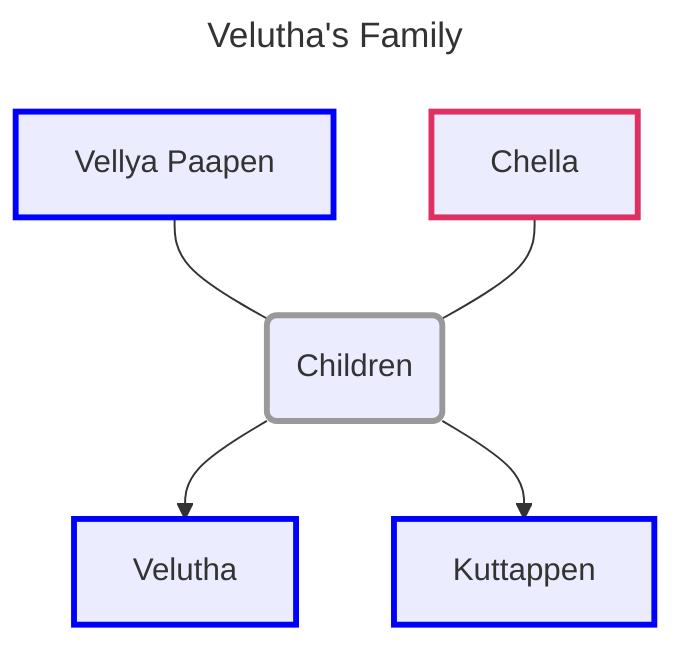

![[the-god-of-small-things.jpg|300]]

Book Link: [The God of Small Things](https://www.goodreads.com/book/show/9777.The_God_of_Small_Things)

[Plot Summary & Analysis - LitCharts](https://www.litcharts.com/lit/the-god-of-small-things/summary)

#### Chapter 1

- We are introduced to the town of Ayemenem (Kerala, India)
- 1993 Rahel (age 31) returns to her family home were her grant aunt lives
- Rahel had come to meet her twin brother. Not seen each other in 23 years
- As children they taught of themselves as same person in different bodies
- We are told about the twins birth which almost occurred on a bus
- 1969 (twins were 7 years old) they are at Sophie Mol’s (cousin) funeral
- Ammu, Estha and Rahel are made to stand separate from the family at funeral
- Rahel imagines Sophie is still alive and she shows Rahel things in the church
- Rahel things of a man falling from a high ledge in the church and dying
- After church Ammu and twins go to police station to meet Velutha
- The police calls Ammu a prostitute and tells her to go home quietly
- After 2 weeks Estha is sent to Calcutta. Estha become quieter and quieter
- The quietness helps him erase the words describing his painful memories
- 23 years later Estha was re-returned to Ayemenem
- The story follows Rahel’s life. Lived with Chacko and Mammachi
- Rahel drifts from school to school getting expelled for different reasons
- Rahel goes to a architecture school in Delhi, stays 8 years without graduating
- Meets Larry marries and moves to Boston. Larry eventually grows tired of Rahel
- They divorce. Rahel comes back to Kerala hearing about Estha’s return
- Grandaunt does not like the twins and wishes that they would leave soon
- She is 83 and wears Mammachi’s jewelry and uses lot of makeup
- She fell in love with a Irish monk at the age of 18
- She performs charitable actions to impress the monk. Nothing comes of it
- Monk leaves Kerala, Baby follows him to Madras. She becomes Roman Catholic
- She joins convent but soon realizes cannot meet the monk
- Baby’s father knows she will not get a husband anymore and sends her to study
- 50 years later Baby discovers TV and spends all her time watching TV with maid
- She had now become paranoid of everything and does not own windows, doors
- We are told of the pickle factory that is across the river from their house
- 1969 after Sophie’s death Ammu consults twin expert to separate her children
- Sends Estha to Calcutta. Estha still haunted with painful memories from past

#### Chapter 2

- In 1969, the twins, mother, uncle and grant aunt are going to watch a movie
- Sophie and Margaret (Englishwomen) come to visit their family in Kerala
- Ammu does not have a surname (husband less)
- Ammu is 27, remembers her past. Lived with her father
- With to Calcutta for a wedding meets a man gets married and moved to Assam
- Realizes that the man is an alcoholic and a compulsive liar
- Ammu’s husband tries to prostitute her to his boss to keep his job
- Ammu refuses starts beating her. Violence eventually spreads to the twins
- Ammu takes the twins and returns back to fathers house
- Describes Ammu’s behavior (wild & unsafe sometimes, caring & kind the others)
- Back in the car we understand that grandaunt does not like the twins
- They are half-Hindu and the children of an divorce
- Rahel thinks about the ad for their pickle business on the cars roof
- The business is run by their grandmother
- Starting becoming popular when grandfather was about to retire
- Pappachi beats Mammachi as he is bitter and jealous
- One day adult Chacko notices this and scolds Pappachi
- Pappachi does not speak with Mammachi again. Destroys a chair out of anger
- Pappachi worked as a Entomologist. He discovers a new species of month
- At the time no one considered it a new species
- Only classified as new after him retiring so was not named after him
- Pappachi considered this the greatest failure in his life
- Chacko tells them that they are all anglophile’s
- Chacko laminates over the state of the Indian people
- Cacho moved to Ayemenem after dead of Pappachi to become pickle baron
- Takes over the business for Mammachi, hires new workers and equipment
- Even with the influx of cash the business slowly starts to decline
- Back in car the twins are worried they will miss the start of their movie
- They stop at a train crossing. Twins read the signs and warning backwards
- A friend of grant aunt got them a kids book which felt was too childish
- They read the book backwards. Friend says she sees Satan in their eyes
- All the cards turn off their engine. Beggars and vendors appear
- They disappear when a huge march of Marxist sweep through carrying flags
- Chacko is an Marxist but is rich landlord so is quite and scared
- Grant aunt is scared of them and tries to avoid eye contact
- We are told about the rise of the Communist movement in Kerala
- Cacho became a beleiever in Marxist in college had fights with Pappachi
- Communist party elected in Kerala. Government grew more and more violent
- Eventually power was returned to Congress. Political turmoil for 10 years
- Communist party reelected. Famine starts in India. Party puts revolution on hold
- CCP not happy with this. They fund a offshoots of the party called Naxalites
- Naxalites starts arming villages and kill people in the name of revolution
- Marches are protesting for a pay increase and abolishment of the caste system
- Rachel sees Velutha open windows to call him. He vanishes into the crowd
- Velutha is an untouchable that works at the pickle factory
- Velutha was very skilled with his hand and learnt carpentry from a German
- He build furniture of the Ipe’s and even assembled machines in the factory
- His father was worried as Velutha did not show shame of an untouchable
- Velutha disappears for 4 years. On return is rehired at the pickle factory
- We are informed of some incident that occurs. Veutha’s father offers to kill him
- At the same time Velutha and the twins have come close
- Back in the car one of the marchers open the door and mocks Baby
- They make her wave their flag. The marchers clear out. Baby is humilated
- Chacko asks Rahel if she really saw Velutha as it would cause trouble at factory
- Baby treats Velutha with anger in the following days
- Sees him as the marcher that humilated her
- Twins think about the story of Julius Caesar and of how he was backstabbed
- Ammu tells this to tell them how no one could be trusted
- The twins blow bubbles with spit which makes Ammu angry. 
- Remids her of Baba. Chacko defends them. 
- Ammu tells him to stop acting as he does not really care about them
- Chacko agrees and says they are milestones around his neck
- The train passes and they drive away

#### Chapter 3

- 1993 the Ayemenem house has become decrepit and filthy
- Baby always watches TV
- Estha comes home quitely and Baby predicts what he is going to do
- Rahel follows him to his room (Ammu’s old room)
- Watches Estha undress. Rahel touches Esthas ear, he does not respond
- Processeds to washing his cloths

#### Chapter 4

- 1969 they reach the theater. They go to the men's and girls washrooms
- Chacko is at the hotel booking their rooms for the night
- They enter the theater. Move has already started. They find their seats
- A song starts playing Estha cannot control himself from singing
- Everyone in theater gets angry. Ammu sends Estha out to the lobby
- Estha sings in the lobby. Wakes up the Lemondrink Man
- Angry and first but convinces Estha to come behind the counter for drink
- Man makes Estha hold his penis while he drinks lemon juice
- Man asks Estha were he is from and about his family
- Man ejaculates into Estha’s hand, wipes it off and sends him off
- Estha is traumatized and compares the clean white children from the movie
- Feels they are deserving of more love than him as he is unclean
- Compares Sophie to white children. Estha feels nauseated
- Ammu takes him to the wash room. He cleans his face and hands continuously
- Lemondrink man is friendly to Ammu but also says he knows where they live
- Estha understands that this is a indirect threat and says nothing to Ammu
- Ammu makes everyone leave the theater. Worried Estha has caught cold
- The Lemondrink man offers Rahel candy but she is repulsed by his yellow teeth
- When they walk out Ammu compliments the mans politeness
- Rahel without tells Ammu to marry him in that case. Everyone freezes
- Ammu tells Rahel when you hurt someone they love you less
- Rahel feels a moth land on her heart and that she is less loved by Ammu
- When the reach the hotel they finds that Chacko is feasting
- Rahel asks Ammu to punish her as she does not want to be loved less
- Rahel sleeps in Chacko’s room. Estha with Ammu and Baby
- In the night Chacko thinks about Sophie who he has not seen in a long time
- Rahel asks if possible for parents to love children less. Says anything is possible
- Estha wakes up and vomits. He goes and stands outside Rahel’s room
- Rahel opens the door and lets Estha in. Chacko ignores them
- Thinks if Velutha was really present in the march
- Pillai has been trying to get the factory workers to rebel against Chacko
- Velutha is the only card carrying Communist but Pillai does not want him
- The factory workers ask for a raise but Mammachi denies them the raise
- Chacko thinks about starting a Union of his own
- The twins sleep while embracing each other

#### Chapter 5

- The story continues in 1993 were the river across the house had dried up
- The history house has been turned into a 5-star hotel
- Narrator mentions that small things still linger there (Rahels watch buried in dirt)
- Rahel walks around their house and runs into Comrade Pillai
- Rahel tells him she is divorced. Pillai shows her pictures of his son (Lenin)
- Rahel remembers Lenin from her childhood
- Both had object lodged up their nose and had to go to the doctor
- Pillai shows a Rahel a photo that has the twins, Lenin and Sophie
- It was taken few days before her death

#### Chapter 6

- 1969 waiting at Airport for Margaret and Sophie
- Made to wear nice cloths and told to be at their best behavior
- Rahel digs threw trash. Estha lost in taughts about the Lemondrink man
- They guests arrive. Everyone greats each other and only says small things
- Estha is distracted by a famous comedian who drops his things
- Baby tries to impress Sophie by quoting Shakespeare
- Estha does not greet Margaret back and Ammu gets angry at him
- Rahel disappears into a curtain and refuses to come out
- Ammu scolds the twins for not listening to her in public
- Chacko goes with Sophie and Margaret to collect their luggage
- Ammu tells them to go and talk with Sophie properly
- Sophie says that she loves Joe the most and does not consider Chacko her dad
- They drive back him. They see a dead Elephant on the way back
- Baby makes them sing a song to showoff their English pronunciation

#### Chapter 7

- In 1993 Rahel goes threw Pappachi’s study
- In her old hiding place she finds the rosary she stole from Baby
- Estha appears in the doorway but does not say anything
- Rahel finds that Ammu has hidden “Wisdom Exercise Books” in same place
- It was used by the twins to practice writing when they were 6
- Rahel reads threw the story laughts at them. Corrections by Ammu below them
- The story shifts to a earlier time when Ammu came to Ayemenem for last time
- She was kicked out by Chacko. Ammu was fired from a job for being too sick
- Rahel had just been expelled from school. Ammu bought her children’s gifts
- Ammu wants to freeze time to the period when the twins were kids
- At lunch Mammachi suggested to Ammu not to vist anymore
- Ammu leaves in silence and never returns
- Ammu died alone in a lodge at the age of 31
- She dreamed of police comming to cut her hair to mark her as a prostitute
- Chruch would not burry her. So the body was taken to crematorium

#### Chapter 8

- Mammachi is waiting at home for Sophie Mol to return. She is almost blind  
- Thinks about her first batch of pickles and the leaking bottles
- Mammachi thinks about Margaret who she does not like
- Thinks about Chacho and his affairs with women from the factory (His Needs)
- She pays the women money so in her mind she can justify them as prostitutes
- In kitchen Kochu Maria is making a cake for Sophie Mol
- When the car arrived everyone stops there work and gathers around the car
- Rahel sees Velutha and goes to play with him as she is no longer required
- Rahels feels like everyone is in a play to impress Sophie Mol
- Rahel tells Velutha she saw him in the march he denies it
- Kochu Maria sniffs Sophie Mol’s hand and Margaret makes an insensitive joke
- Ammu gives a scarsactic reply. Chacko gets angry and asks for apology
- Ammu storm off. Everyone wonders where Ammu got her rebellious behavior
- She learnt it from her father who was nice to others but bad to his family
- Kochu Maria cuts the cake and Mammachi instructs to give everyone a piece
- Kochu Maria boosts to Rahel that Sophie will be the next Kochamma
- Rahel gets angry and storms away to kill some ants
- Sophie comes over and tells her to leave one ant lonely. She ignore her and kills it
- The entire crowd follows Sophie. Rahel runs away

#### Chapter 9

- in 1993, Rahel explored the abondoned ornamental garden
- Remembers Sophie tells she likes Joe more than Chacko
- And she feels lonely when the twins leave her behind
- The twins take Sophie to meet Velutha. All dressed as ladies
- Rahel thinks of how sweet Velutha was playing along with their fantasies
- Rahel sees Estha in his room and things thinks of their troubled past
- She wishes Estha could think of them as victims not perpetrators
- She understands that the only true victim was Velutha
- She hears the kathakali from a History House and goes towards it
- Sees the remains of Paradise Pickles

#### Chapter 10

- in 1969, when cake is being served Estha goes to the Pickle Factory to think
- Walks among the products and stirrers a cauldron of banana jam
- Thinks about the Lemondrink man and what he could do
- Estha has 2 taught - anything can happen at anytime and its best to be prepared
- He wishes of a boat he could use to escape the Lemondrink man
- Rahel comes to the factory and Estha reluctantly tells her the plan
- Estha wants to go to the History House across the river
- The house is supposed to have the ghost of Kari Saipu who is pinned to a tree
- They decide to become Communists so they don't have to believe in ghosts
- They decide to go to the History House while Ammu is napping
- Rahel goes for her Nap and lies awake till Ammu is asleep
- Rahel thinks of the communish flag and Estha sitting on boat
- Rahel runs and goes to Estha and finds him really sitting on a overturned boat
- They put the boat in the river but it sinks so they decide to take it to Velutha
- At the house only Kuttappen (Velutha’s paralized brother) is present
- They talk about Sophie Mol and the boat
- Velutha comes home and sees the kids and helps them fix the boat
- Velutha talks with Kuttappen and confirms that he was at the communish march
- He knows that he should be afraid that the Ipes saw him

#### Chapter 11

- Ammu is still napping and dreams of a one-armed man
- Whenever she touches him she feels goosebumps
- She thinks of this man as the God of small things
- The twins hover over her and try to wake her up
- Looking at Ammu’s face they feel feel like she is having a nightmare
- Ammu wakes up as says she was happy in the dream
- Estha asks if being happy in dreams count as being happy
- Ammu turns on the radio and listens to a song about star-crossed lovers
- Ammu notices the twins are covered in saw-dust and warns them about going to Velutha’s house without saying his name
- Ammu knows that the God of Small Things in her dream was Velutha
- Estha and Rachel climb over their mothers body and try to kiss her
- Ammu gets up and goes to the bathroom and takes a look at herself
- She thinks about what the future has in store for a disgraced man-less women
- The narrator elaborators on the room and events that will take place in future
- Chacko will kick down the door and throw Ammu out of the house
- Estha’s luggage so he can be returned would be packed in the same place

#### Chapter 12

- In 1993 Rahel approaches the temple where the kathakali performers are asking forgiveness from their god for their tourist-friendly hotel
- The temple elephant is asleep. The performance as already started
- The stories of the Gods are explained and how kathakali is no move a viable source of income
- Rachel watch the story and how the actor playing the part is drunk
- Rahel then notices that Estha has also entered the temple
- They stay all night and watch the entire performance
- At dawn Pillai greets the twins as they leave the temple

#### Chapter 13

- In 1969, Sophie wakes up and thinks about Joe
- She sees all of Chacko’s stuff (staying in his room)
- Narrator talks about Margaret and Chacko’s relation
- How they meet at a cafe (Margaret waitress at cafe)
- Margaret confused Chacko’s acceptance of her as love
- Chacko liked Margaret’s English self-sufficiency
- Got married without consent from Margaret’s family
- They soon has financial troubles. Margaret meet Joe
- When Sophie was born Margaret asked for divorce
- Heartbroken Chacko moved back to India and took up a teaching job
- When Pappachi died he moved home to take up the pickle business
- Margaret would still write to him about Sophie and Joe
- Margaret was teaching at a school when she got the news that Joe died
- When she got invitation for Chacko for vacation they came to Ayemenem
- Margaret never forgave herself for the visit to India
- When she got back from booking her return ticket. She sees Sophie’s dead body
- All three kids where missing the day the events took place
- Ammu was locked up in her room
- In her anger she till the twins they are millstones around her neck
- The previous night Vellya Pappen came to their house drunk and sad
- He tells Mammachi who he had seem that Velutha and Ammu where lovers
- Baby Kochamma sees it has righteous punishement for Ammu and the twins
- They trick Ammu and lock her in her room and plan to send Velutha away
- Baby goes to the police and says that Velutha tried to rape Ammu
- And that dead of Sophie and the disappearance of the kids might be his fault
- Margaret starts to hate the twins for surviving and blames Estha for the death

#### Chapter 14

- 2 weeks before Sophie’s death. Chacko goes to meet Pillai
- Pillai arrives at home after sometime and asks his niece to call some people so that they can see that Chacko is at his house
- They make small talk, Chacko orders new labels for the pickle business
- He asks about the march and if Velutha had gone to the march
- Pillai asks Chacko to send Velutha away as the workers are not happy because of his caste
- After Sophie’s dead Chacko abandons the pickle business
- On the night of Sophie’s dead Velutha is coming back after fixing a machine
- He is informed that he is need at Ayemenum and goes to meet Mammachi
- Mammachi screams at him and spits in his face
- Velutha goes to Pillai to ask for help but is hold the party won’t help him

#### Chapter 15

- Velutha in a trance swims towards the History House
- He still thinks that things will eventually get better

#### Chapter 16

- The twins go to the History house since even Ammu does not want them
- Estha has already equipped the house with things to escape the Lemonade man
- Sophie convinces them to take her along with them
- All 3 of them get in the boat, the river is faster and stronger than expected
- The boat hits a log and tips over, the twins manage to make it to the shore
- Realized Sophie is missing. Soon realize the she has most likely drowned
- Traumatized they enter the History house and do not see Velutha

#### Chapter 17

- In 1993 Estha sits alone on his bead, the house has fallen into disarray
- Baby writes “I Love You” in her journal everyday
- Father Mulligan has died 4 years ago after converting to Hinduism
- Rahel is lying on Estha’s bed and examining her bosy which is like Ammu’s
- Estha remembers leaving Ammu 23 years ago at the Cochin Terminus
- Remembers the events of the Terror that occurred in newspaper articles

#### Chapter 18

- In 1969, 6 policemen cross the river to look for Velutha
- The twins and Velutha are asleep when the police find them
- The policemen brutally beat Velutha
- The kids release that Velutha was also present with them
- The narrator describes Velutha’s broken body
- Rahel tells Estha that this is not Velutha but his twin brother
- The police find the kids and are friendly with them
- They see the supplies and are worried Velutha did not kidnap them
- So they take all of the toys for themselves and drag Velutha with them

#### Chapter 19

- The twins are at the police station with the Inspector
- After seeing all the toys, the Inspector realizes something is wrong
- He calls for Baby. He is not friendly to Baby this time
- He tells that Velutha will die soon and if Velutha did not kidnap the kids then it means that they killed an innocent man
- He tells that unless Ammu files a rape report of the kids identify Velutha as their kidnapper they would have to charge Baby for false report
- Baby is terrified and tries to convince the kids to change their story
- The Insepctor leaves the kids alone with Baby, she acquires them of killing Sophie and says that there is no forgiveness for their crime
- She tells them of the horrors of prison and tells to answer “yes” to the polices question so that they could save their mother
- The Inspector takes Estha to see Velutha’s broken body
- Inspectors asks Estha and the question and he answers “yes”
- On ride home Estha tells Rahel she was right and that wasn’t Velutha
- When Ammu goes to the police station after funeral Baby is scared that her plan would fail. Baby plans of a way to have Ammu returned
- She plans in Chacko’s mind the idea that Ammu and the twins caused the death
- Chacko breaks down the door to Ammu’s room and kicks her out of the house

#### Chapter 20

- Story continues to the day when Estha is sent to Madras
- Ammu promises Estha and she would get him as soon as she has a job
- They soon start describing their dream house
- The train starts to move and the twins scream as they are separated
- 23 years later they are lying in Estha’s bed and have sex
- The story move to 1969, the day Sophie came to the house
- Ammu puts them to sleep early and they can see that Ammu is not angry
- Ammu is reluctant to go and join Sophie and Margaret
- She dreams and longs for the “God of Small Things”

#### Chapter 21

- Later the same night Ammu goes to the porch to listen to rado
- Ammu suddenly gets up and walks towards the river sobbing
- At the same time Velutha is floating in the river thinking about Ammu
- He sees her and swims towards her. Ammu finally sees Velutha
- She goes and kisses him. Velutha knows he will loose everything if this becomes known to other but still caries on
- They have sex by the river at the location where Velutha has found the boat
- Ammu both laughs and cries as she feels safe in Velutha’s hands
- For 13 nights Ammu and Velutha kept meeting in the same place
- At the end of every night they promise each other “tomorrow” as they know they cannot promise any longer as things could change any moment.

